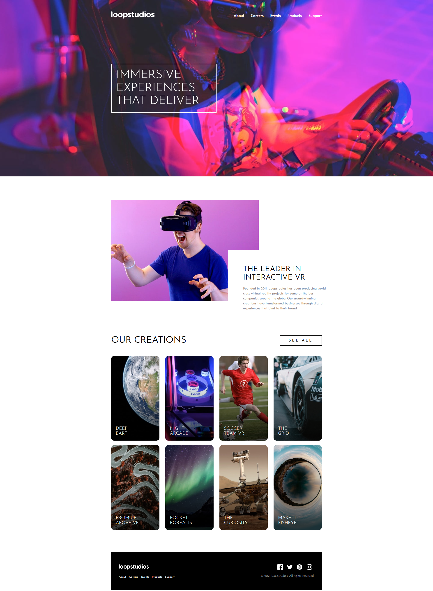
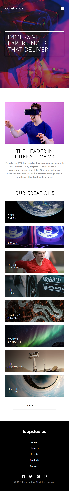
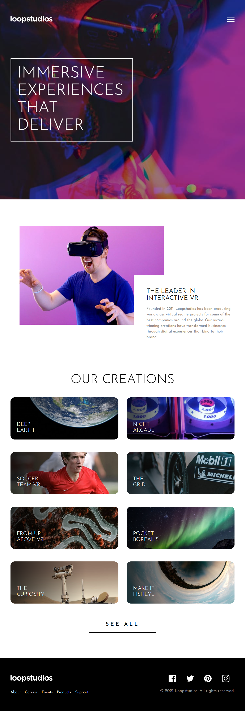
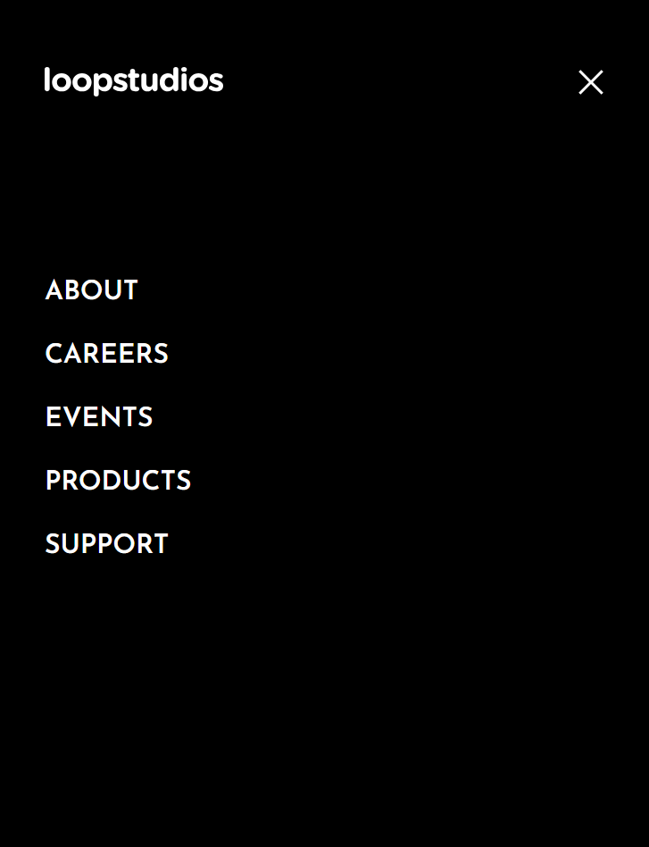

# Frontend Mentor - Loopstudios landing page solution

This is a solution to the [Loopstudios landing page challenge on Frontend Mentor](https://www.frontendmentor.io/challenges/loopstudios-landing-page-N88J5Onjw). Frontend Mentor challenges help you improve your coding skills by building realistic projects.

## Table of contents

- [Overview](#overview)
  - [The challenge](#the-challenge)
  - [Screenshot](#screenshot)
  - [Links](#links)
- [My process](#my-process)
  - [Built with](#built-with)
  - [What I learned](#what-i-learned)
  - [Continued development](#continued-development)
  - [Useful resources](#useful-resources)
- [Author](#author)
- [Acknowledgments](#acknowledgments)

## Overview

### The challenge

Users should be able to:

- View the optimal layout for the site depending on their device's screen size
- See hover states for all interactive elements on the page

### Screenshot

### Links

- Solution URL: [Add solution URL here](https://github.com/Jstickz/loopstudios-landing-page-main)
- Live Site URL: [Add live site URL here](https://loopstudios-landing-page-main-bay-psi.vercel.app/)

## My process

### Built with

- Semantic HTML5 markup
- SCSS
- Flexbox
- CSS Grid
- Mobile-first workflow
- JavaScript
- [Scss](https://sass-lang.com/) - For styles

### What I learned

This is where I learned how to use SCSS for styling. I must say that I enjoyed the learning process. It made my work more organised compared to the way it used to be. Making the website responsive was easy due to the feature that Sass has to write functions and declare variables that can be used everywhere in the code. I am not yet totally good with this, but I know I will with time.

### Continued development

I would like to learn more and master SCSS with time, I think I will learn reactjs and I cant wait.

### Useful resources

- [Example resource 1](https://youtu.be/jfMHA8SqUL4?si=O0eTwul8QKth2tue) - This youtube video helped me to learn the style framework I used.

## Author

- Website - [John Adeoye](https://www.your-site.com)
- Frontend Mentor - [@Jstickz](https://www.frontendmentor.io/profile/Jstickz)

## Acknowledgments

Thanks to FrontEnd mentor for this challenge. It was really challenging buit I made it.
